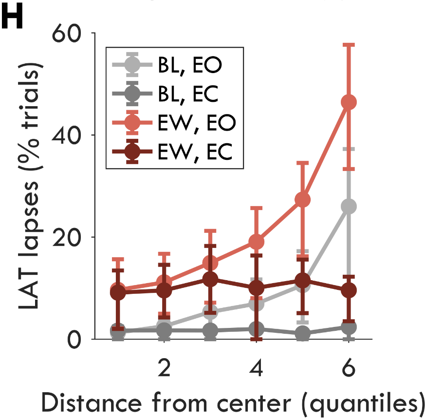
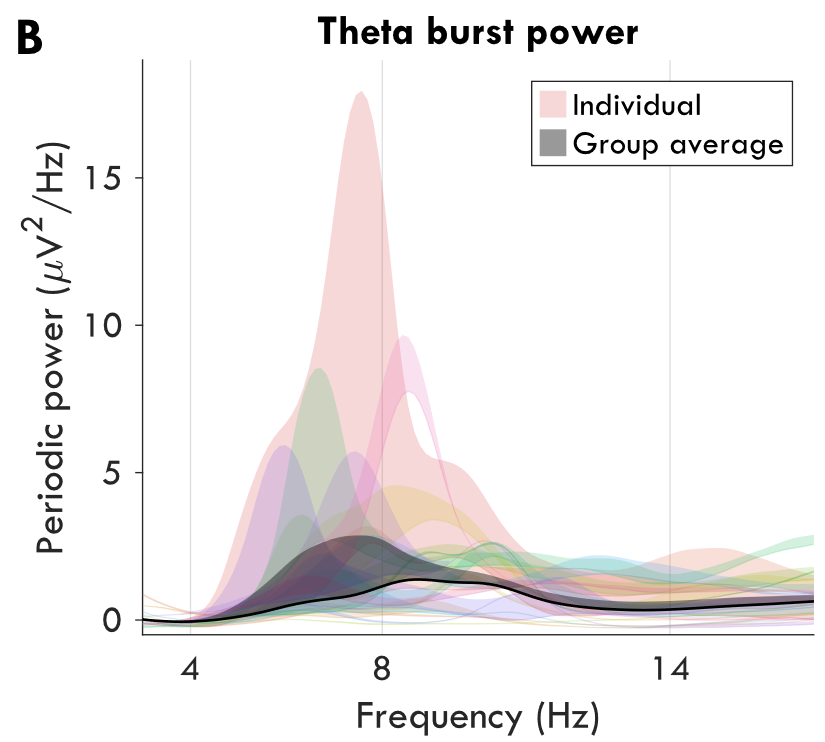

# chART
This is a collection of functions for making nice scientific plots. I make it for myself, so its not exhaustive, and its always a work in progress. 


## The plots

`average_rows()`
Averages rows of data into a classic line plot with error bars.


`increase_from_baseline()`



## How it works

### Example code

```matlab
PlotProperties = chART.load_plot_properties({'Template'});

figure('units', 'centimeters', 'position', [0 0 10 20])
chART.sub_plot([], [1 2], [1, 1], [], true, 'A', PlotProperties)
chART.plot.individual_rows(Data, Stats, xLabels, yLim, PlotProperties)

chART.save_figure('Figure1', Folder, PlotProperties)

```

### Plot properties
Plots should have consistent formatting, so every plotting function takes as a final input variable a struct of `PlotProperties`, including font, text size, etc. Inside the folder `+chART/+properties`, there are some example formats that I use, and an empty template. I recommend creating a copy of LSM and filling in whatever parameters you like to use. 
To call the format, just run `PlotProperties = chART.load_plot_properties({FormatTitle})` These properties are assembled into a MATLAB structure. Alternatively, you could recreate the structure with just the fields you need for a given plot (not recommended). If this is not provided (most) plotting scripts will use the defaults.

### sub plots
I created my own system for putting multiple plots in the same figure. This is optional, but allows better control of margins.

### plots
All the plots are saved in the `+plot` folder.

### utils
These are all functions that don't produce plots but are still occasionally needed.


## External references

- colorcet